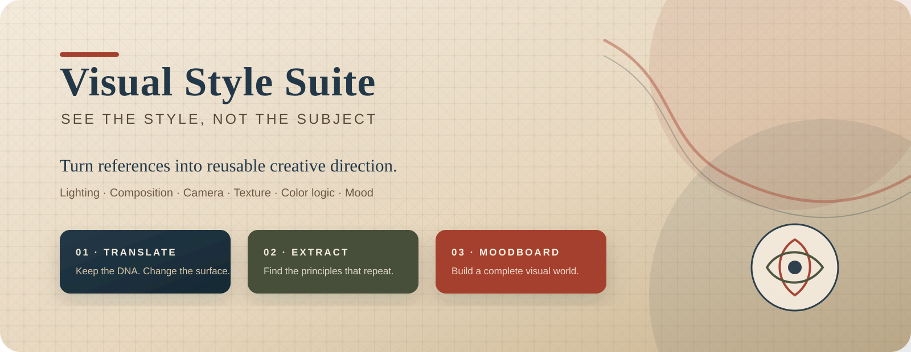
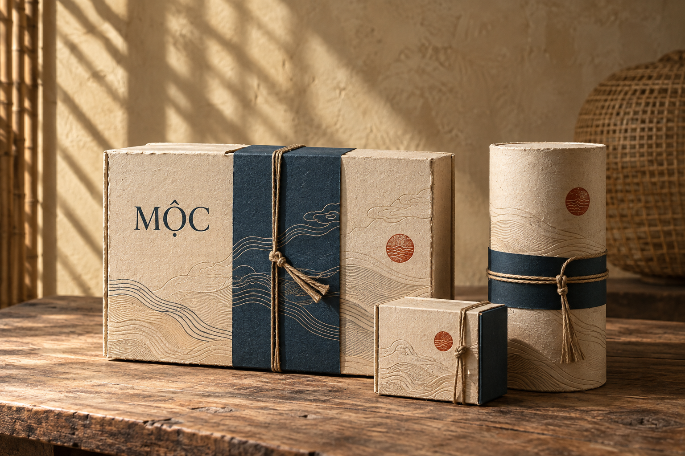
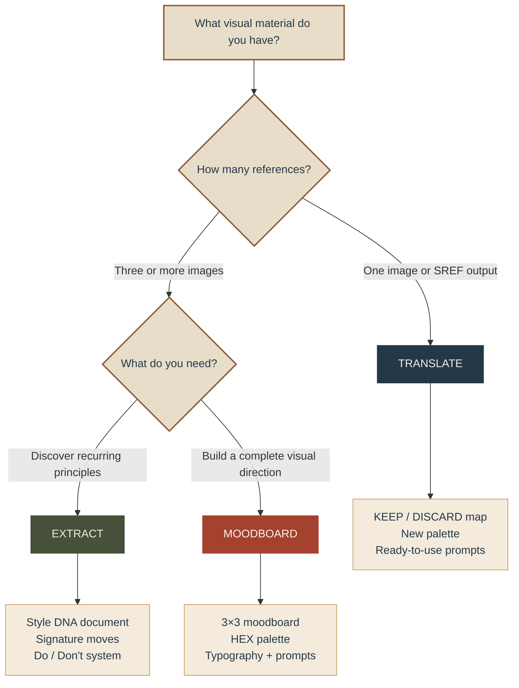
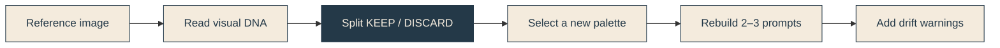
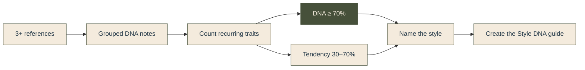
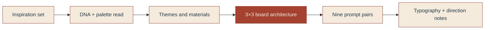

<div align="center">



<br />

[](#choose-your-workflow)
[](#the-9-layer-dna-lens)
[](#outputs-at-a-glance)
[](#quick-start)

### An AI visual-analysis system that turns references into reusable creative direction

**Keep the visual intelligence. Change the subject, palette, and surface.**

[Choose a workflow](#choose-your-workflow) · [See the process](#how-the-engine-works) · [Quick start](#quick-start) · [Explore the files](#repository-map)

</div>

---

## Why Visual Style Suite?

Most visual analysis stops at *“warm colors, cinematic lighting, minimal composition.”* Visual Style Suite goes deeper. It separates the structural decisions that make a style recognizable from the surface details that can safely change.

| 🧬 Find the DNA | 🎨 Rebuild with intention | 🧭 Make it reusable |
|---|---|---|
| Identify lighting behavior, composition, camera language, rendering, texture, color logic, mood, genre, and subject treatment. | Preserve the important relationships while replacing palettes, subjects, environments, and recognizable motifs. | Convert the analysis into prompt systems, Style DNA documents, palettes, moodboards, and repeatable creative rules. |

> **The golden rule**<br />
> “Orange and teal” is a palette. “A muted world with one complementary accent at 10% coverage” is visual DNA.

---

## Featured example · Mộc đương đại

[](examples/moc-duong-dai-dau-an-viet/README.md)

See the full workflow applied to a contemporary Vietnamese handicraft brand: a nine-layer Visual DNA, 60/30/10 palette, 3×3 moodboard, product and artisan imagery, reusable prompts, and a finished packaging system.

<div align="center">

### [Explore the complete case study →](examples/moc-duong-dai-dau-an-viet/README.md)

</div>

---

<a id="choose-your-workflow"></a>

## Choose your workflow



| Workflow | Best when you have | Core question | Primary output |
|---|---|---|---|
| **01 · TRANSLATE** | One reference image or 1–2 sample outputs from a Midjourney SREF | “How do I keep this sophistication without copying its palette or subject?” | KEEP/DISCARD analysis, new palette, generation prompts, drift warnings |
| **02 · EXTRACT** | Three or more related references | “What visual principles consistently define this collection?” | Named Style DNA, invariants, signature moves, free parameters, reusable suffix |
| **03 · MOODBOARD** | Inspiration images for a brand, campaign, or visual identity | “How does this inspiration become a complete creative world?” | 3×3 board plan, HEX palette, typography, nine prompt pairs, direction notes |

---

<a id="how-the-engine-works"></a>

## How the engine works

Every mode uses the same analytical spine:

```mermaid
flowchart LR
    I["Reference inputs"] --> R["9-layer DNA read"]
    R --> S["DNA vs. surface"]
    S --> L["Lock the visual logic"]
    L --> D["Differentiate deliberately"]
    D --> P["Package for reuse"]

    classDef source fill:#E7DDC9,stroke:#8C5A3C,color:#243948;
    classDef core fill:#243948,stroke:#243948,color:#F4EBDD;
    classDef action fill:#46503A,stroke:#46503A,color:#F4EBDD;
    classDef finish fill:#A5412F,stroke:#A5412F,color:#FFF3E4;
    class I source;
    class R,S core;
    class L,D action;
    class P finish;
```



### 01 · TRANSLATE — keep the DNA, change the surface



**What stays:** lighting behavior, color relationships, camera language, rendering, texture, mood machinery.<br />
**What changes:** literal hues, signature subjects, locations, distinctive compositions, recognizable motifs.

<details>
<summary><strong>Example request</strong></summary>

```text
Run Style: keep the intimate lighting, compressed camera language, and
muted-plus-accent color logic from this reference, but rebuild it with
an olive, burgundy, and parchment palette.
```

</details>

### 02 · EXTRACT — turn a collection into a design language



The output distinguishes **invariants** from **free parameters**, names three signature moves, and ends with deliberate differentiation moves so the result becomes a new identity rather than an imitation.

<details>
<summary><strong>Example request</strong></summary>

```text
Analyze these eight campaign references. Find the visual principles that
appear in at least 70% of them and turn the result into a reusable Style DNA guide.
```

</details>

### 03 · MOODBOARD — build a complete visual world



The 3×3 board balances subject, material, abstract color, typography, and light. Every cell has a purpose and carries a specific part of the DNA.

<details>
<summary><strong>Example request</strong></summary>

```text
Create a brand moodboard from these references. Include a 60/30/10 HEX palette,
nine cell concepts, Midjourney and model-agnostic prompts, typography pairings,
and a concise creative-direction guide.
```

</details>

---

<a id="the-9-layer-dna-lens"></a>

## The 9-layer DNA lens

| | Layer | The engine looks for |
|---:|---|---|
| ① | **Lighting** | Direction, hardness, ratio, temperature, bloom, bounce, practicals |
| ② | **Composition** | Framing logic, negative space, eye path, depth, crop behavior |
| ③ | **Camera language** | Focal feel, depth of field, angle, distance, compression |
| ④ | **Rendering** | Photographic, painterly, graphic, 3D, edge treatment, finish |
| ⑤ | **Texture & materials** | Matte, gloss, grain, paper tooth, weathering, surface behavior |
| ⑥ | **Color relationships** | Contrast strategy, saturation hierarchy, value, temperature, coverage |
| ⑦ | **Mood** | Emotional register and the exact choices that create it |
| ⑧ | **Era & genre** | Period signals, visual grammar, load-bearing cultural markers |
| ⑨ | **Subject treatment** | Heroic, candid, tender, clinical, iconic, intimate, observational |

<div align="center">

`observe` → `name precisely` → `test DNA vs. surface` → `encode for reuse`

</div>

---

<a id="outputs-at-a-glance"></a>

## Outputs at a glance

| Deliverable | TRANSLATE | EXTRACT | MOODBOARD |
|---|:---:|:---:|:---:|
| 9-layer DNA analysis | ✓ | ✓ | ✓ |
| KEEP / DISCARD map | ✓ | — | — |
| HEX palette with usage ratios | ✓ | Optional | ✓ |
| Midjourney prompts | ✓ | Style suffix | ✓ |
| Model-agnostic prompts | ✓ | Style suffix | ✓ |
| Drift warnings | ✓ | ✓ | ✓ |
| Invariants and free parameters | — | ✓ | ✓ |
| Style DNA document | — | ✓ | Direction guide |
| 3×3 moodboard architecture | — | — | ✓ |
| Typography recommendations | — | Optional | ✓ |
| Differentiation moves | ✓ | ✓ | ✓ |

### Prompt architecture

```text
[subject]
  + [subject treatment]
  + [environment]
  + [lighting DNA]
  + [camera language]
  + [rendering and texture]
  + [color logic and palette]
  + [mood register]
  + [parameters]
```

One **locked style suffix** keeps a series consistent. Only the subject and environment should change from prompt to prompt.

---

<a id="quick-start"></a>

## Quick start

### 1. Install the skill

Clone or copy this repository into your Codex/ChatGPT skills directory as `visual-style-suite`:

```text
<skills-directory>/visual-style-suite/
├── SKILL.md
└── references/
```

The runtime skill only needs `SKILL.md` and `references/`; this README and `assets/` are repository documentation.

### 2. Start with a natural request

```text
Run Style
```

Or describe the outcome directly:

```text
Make my campaign feel like these references, but use a completely new palette.
```

```text
Extract the visual DNA shared by these images and package it as a style guide.
```

```text
Turn this inspiration set into a 3×3 brand moodboard with prompts and typography.
```

### 3. Provide the right references

| Mode | Recommended input |
|---|---|
| TRANSLATE | 1 clear reference, or 1–2 visual outputs from an SREF |
| EXTRACT | At least 3 references; 5–12 gives a stronger signal |
| MOODBOARD | 6–15 images mixing subjects, textures, materials, color, type, and atmosphere |

> A Midjourney SREF code alone is not visually analyzable. Include one or two sample outputs.

---

<a id="repository-map"></a>

## Repository map

```text
visual-style-suite/
├── README.md
├── SKILL.md
├── assets/
│   └── visual-style-suite-banner.svg
├── examples/
│   └── moc-duong-dai-dau-an-viet/
│       ├── README.md
│       ├── prompts.md
│       └── images/
│           ├── moodboard-3x3.png
│           ├── hero-product.png
│           ├── artisan-process.png
│           └── final-packaging.png
└── references/
    ├── dna-framework.md
    ├── prompt-recipes.md
    └── style-guide-template.md
```

| File | Purpose |
|---|---|
| [`SKILL.md`](SKILL.md) | Trigger rules, mode selection, workflows, outputs, and global safeguards |
| [`examples/moc-duong-dai-dau-an-viet/`](examples/moc-duong-dai-dau-an-viet/README.md) | Complete Vietnamese handicraft case study, generated imagery, final packaging, and reusable prompts |
| [`references/dna-framework.md`](references/dna-framework.md) | Precise vocabulary and the complete nine-layer analysis system |
| [`references/prompt-recipes.md`](references/prompt-recipes.md) | Midjourney and model-agnostic prompt construction patterns |
| [`references/style-guide-template.md`](references/style-guide-template.md) | Reusable structure for EXTRACT-mode Style DNA documents |

---

## Design principles

| Principle | What it means in practice |
|---|---|
| **Describe, never reproduce** | Analyze visual principles without claiming to replicate a living artist's style. |
| **Separate DNA from surface** | Preserve structural relationships while allowing subjects, locations, and hues to change. |
| **Make every claim checkable** | Prefer “soft side light with a warm–cool split” over “beautiful lighting.” |
| **Explain the why** | Every recommendation includes the effect it creates and why it belongs. |
| **Differentiate deliberately** | Every workflow pushes the result away from imitation and toward a signature identity. |

---

## License

No license has been specified for this repository. Until one is added, all rights remain with the repository owner.

<div align="center">

---

**Visual Style Suite** · See the style, not the subject.

</div>
