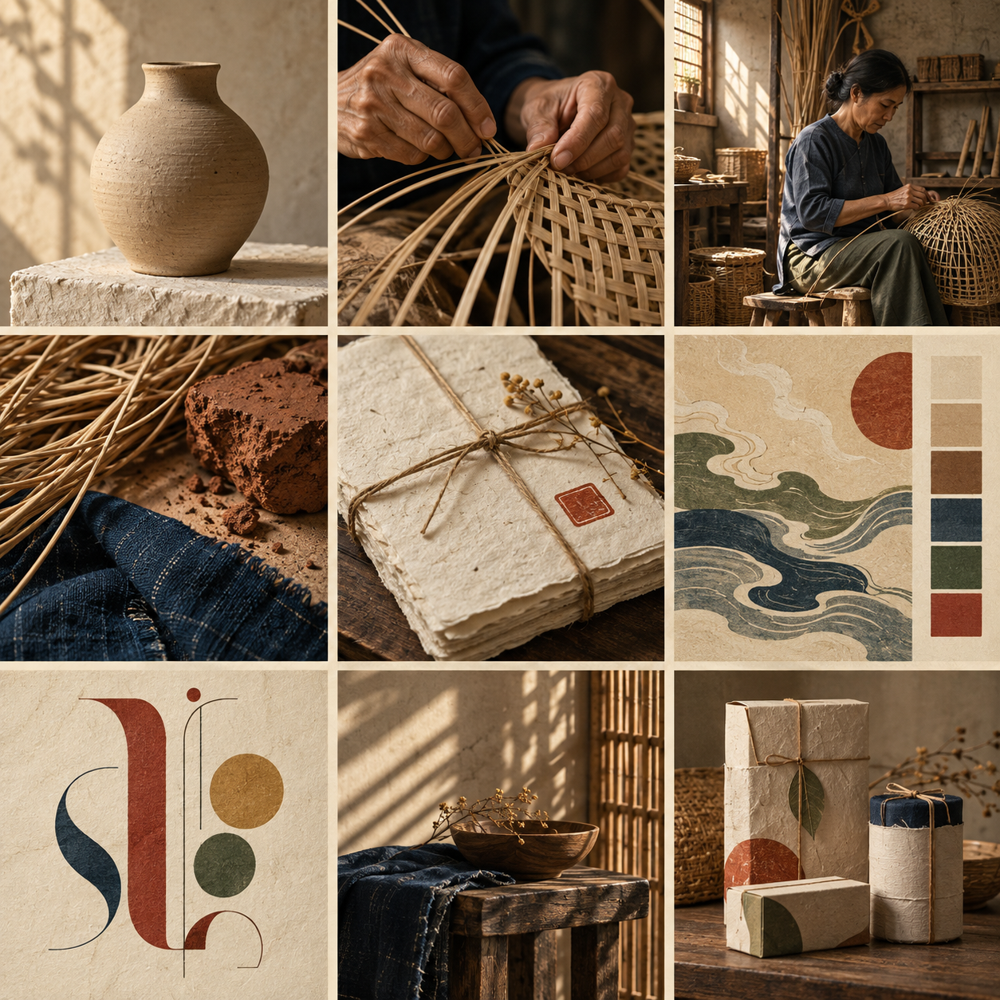
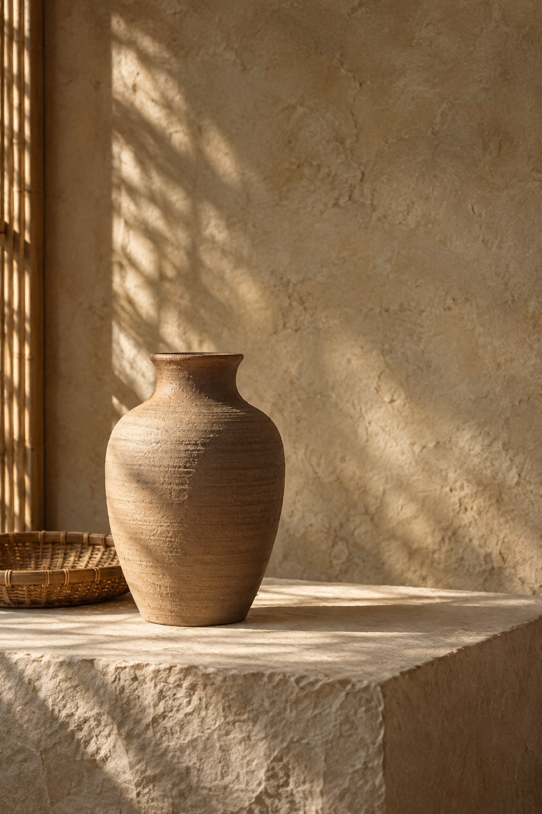
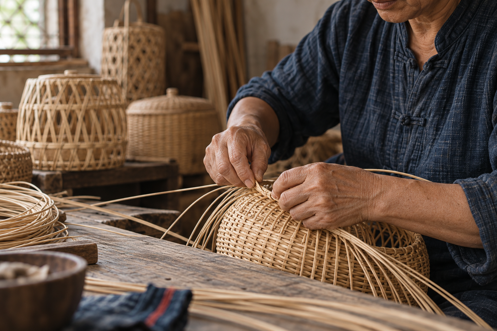

<div align="center">

# Mộc đương đại — dấu ấn Việt

### Từ chất liệu thủ công bản địa đến một hệ hình ảnh thương hiệu đương đại

**Quiet craft · Vietnamese soul · Contemporary form**

[Xem quy trình](#quy-trình-thiết-kế) · [Khám phá Visual DNA](#visual-dna) · [Xem sản phẩm cuối](#sản-phẩm-cuối) · [Dùng lại prompt](prompts.md)

</div>


> **Bài toán:** Xây dựng một thế giới hình ảnh cho thương hiệu thủ công mỹ nghệ Việt Nam — đủ mộc để giữ dấu tay người làm, đủ tinh giản để bước vào không gian sống đương đại.

---

## Tổng quan dự án

| | Định hướng |
|---|---|
| **Tinh thần** | Tĩnh, ấm, có chiều sâu, trân trọng dấu vết thủ công |
| **Cảm hứng** | Gốm mộc, mây tre, giấy dó, vải chàm, ánh sáng qua phên tre |
| **Khách hàng hình dung** | Người yêu thiết kế, vật liệu tự nhiên và sản phẩm có câu chuyện |
| **Ứng dụng** | Campaign, social content, editorial, bao bì và quà tặng thủ công |
| **Kết quả** | Visual DNA 9 lớp, moodboard 3×3, bộ ảnh thương hiệu và hệ bao bì hoàn chỉnh |

### Tuyên ngôn sáng tạo

**Không hoài cổ hóa Việt Nam. Không dùng biểu tượng truyền thống như đồ trang trí.** Bản sắc được truyền tải bằng vật liệu thật, khoảng thở, nhịp sáng và dấu vết bàn tay — những yếu tố có thể cảm nhận trước khi cần giải thích.

---

## Quy trình thiết kế

```mermaid
flowchart LR
    A["Cảm hứng<br/>thủ công Việt"] --> B["Đọc Visual DNA<br/>9 lớp"]
    B --> C["Chốt 3<br/>signature moves"]
    C --> D["Khóa bảng màu<br/>60 / 30 / 10"]
    D --> E["Dựng moodboard<br/>3 × 3"]
    E --> F["Khóa style suffix<br/>cho cả series"]
    F --> G["Tạo bộ ảnh<br/>thương hiệu"]
    G --> H["Ứng dụng cuối<br/>hệ bao bì"]

    classDef source fill:#E7DDC9,stroke:#8C5A3C,color:#263B47;
    classDef core fill:#263B47,stroke:#263B47,color:#F4EBDD;
    classDef action fill:#46503A,stroke:#46503A,color:#F4EBDD;
    classDef finish fill:#A5412F,stroke:#A5412F,color:#FFF3E4;
    class A source;
    class B,C,D,E core;
    class F,G action;
    class H finish;
```



---

## Moodboard 3×3



| Hàng | Vai trò |
|---|---|
| **01 · Vật thể & con người** | Gốm mộc, đôi tay đan lát, nghệ nhân trong xưởng |
| **02 · Chất liệu & mã nhận diện** | Mây, đất, chàm, giấy dó, triện son, nét mây–sóng |
| **03 · Hệ thống ứng dụng** | Chữ editorial, ánh sáng qua phên tre, bao bì hoàn chỉnh |

Moodboard được thiết kế như một hệ thống, không phải một bảng ảnh ngẫu hứng: mỗi ô giữ một phần DNA và mọi ô cùng chia sẻ ánh sáng, độ tương phản, sắc độ và cảm giác bề mặt.

---

<a id="visual-dna"></a>

## Visual DNA

| Lớp | Quyết định hình ảnh |
|---|---|
| **Ánh sáng** | Ánh sáng sớm mềm từ bên trái; xuyên qua phên tre; tương phản khoảng 3:1 |
| **Bố cục** | Bất đối xứng, chủ thể thấp hoặc lệch trục, 45–60% khoảng thở |
| **Ngôn ngữ máy ảnh** | Cảm giác 50–85 mm, gần gũi nhưng không xâm lấn, độ sâu trường ảnh vừa phải |
| **Rendering** | Ảnh editorial chân thực, hạt film quét rất nhẹ, không bóng bẩy kiểu CGI |
| **Chất liệu** | Đất nung không men, mây tự nhiên, gỗ cũ, giấy xé cạnh, vải dệt lì |
| **Quan hệ màu** | Nền trung tính ấm; chàm và nâu đất tạo chiều sâu; son đỏ chỉ dùng làm dấu |
| **Cảm xúc** | Tĩnh, vững, ấm và có phẩm chất thiền nhưng không xa cách |
| **Thể loại** | Di sản đương đại, editorial thủ công, tránh mỹ học lưu niệm du lịch |
| **Xử lý chủ thể** | Vật thể được đối đãi như hiện vật văn hóa; con người xuất hiện tự nhiên trong lao động |

### Ba signature moves

1. **Khoảng thở có chủ đích** — sản phẩm chỉ chiếm khoảng 40–55% khung hình, tạo cảm giác trân trọng và cao cấp.
2. **Ánh sáng chạm bề mặt** — luồng sáng xiên làm lộ thớ giấy, xơ mây, vết tay trên đất và độ lì của vải.
3. **Một dấu son nhỏ** — đỏ son dưới 7% diện tích đóng vai trò như chữ ký, không trở thành màu trang trí bao phủ.

### Bảng màu 60 / 30 / 10

| Tỷ lệ | Màu | HEX | Vai trò |
|---:|---|---|---|
| 35% | Gạo dó | `#E7DDC9` | Nền sáng, giấy và khoảng thở |
| 25% | Vải thô | `#C6B69B` | Lớp trung gian ấm |
| 15% | Nâu gốm | `#8C5A3C` | Vật thể và chiều sâu vật liệu |
| 10% | Chàm sâu | `#263B47` | Chữ, mảng neo và tương phản |
| 5% | Lá già | `#46503A` | Sắc tự nhiên phụ trợ |
| 7% | Son mài | `#A5412F` | Dấu triện và điểm nhìn |
| 3% | Kim tre | `#C99B55` | Ánh sáng và chi tiết rất nhỏ |

---

## Bộ ảnh thương hiệu

<table>
  <tr>
    <td width="50%" valign="top">
      
      <br /><strong>01 · Hero product</strong><br />Một vật thể gốm và một khay mây trong 60% khoảng thở; ánh sáng qua phên tre biến bề mặt thành nhân vật chính.
    </td>
    <td width="50%" valign="top">
      
      <br /><strong>02 · Artisan process</strong><br />Khoảnh khắc lao động tự nhiên, tập trung vào kỹ năng và mối quan hệ giữa bàn tay với vật liệu.
    </td>
  </tr>
</table>

### Nguyên tắc chọn ảnh

- Ưu tiên **một chủ thể chính** thay vì bày nhiều sản phẩm.
- Cho thấy **dấu vết làm bằng tay**: thớ vật liệu, sai lệch nhỏ, cạnh giấy và vết dụng cụ.
- Dùng **hành động thật** khi có nghệ nhân; tránh nụ cười dàn dựng và tạo dáng du lịch.
- Không dùng rồng, chùa, họa tiết Á Đông chung chung hoặc trang phục như đạo cụ nhận diện.

---

<a id="sản-phẩm-cuối"></a>

## Sản phẩm cuối


### Hệ bao bì “Mộc”

Hệ thống gồm hộp cứng bọc giấy thủ công, ống giấy, hộp sản phẩm nhỏ, đai giấy chàm, dây sợi tự nhiên và một triện son. Chữ **MỘC** chỉ xuất hiện một lần; các bề mặt còn lại được dẫn dắt bằng nhịp vật liệu và nét mây–sóng dập chìm.

| Quyết định | Lý do |
|---|---|
| **Giấy không tráng phủ** | Giữ cảm giác chạm thật và hấp thụ ánh sáng mềm |
| **Đai chàm** | Tạo điểm neo thị giác mà không cần nền đen hoặc ép kim |
| **Dấu son thủ công** | Tạo chữ ký văn hóa nhỏ, có độ lệch tự nhiên |
| **Nét mây–sóng đơn tuyến** | Gợi Việt Nam bằng chuyển động, không minh họa biểu tượng theo nghĩa đen |
| **Không dùng nhựa và bề mặt bóng** | Bảo toàn tinh thần mộc, tĩnh và có tuổi |

---

## Giữ phong cách nhất quán

Mỗi prompt thay đổi chủ thể và bối cảnh nhưng luôn khóa bốn nhóm quyết định:

```text
soft directional morning light from the left through bamboo slats,
controlled 3:1 contrast, restrained asymmetrical composition with generous
negative space, tactile matte natural materials, contemporary Vietnamese
heritage editorial, warm rice-paper neutrals with deep indigo and a tiny
vermilion accent, subtle scanned 35mm grain, quiet-grounded mood
```

Các prompt đầy đủ để tái tạo moodboard và từng asset được lưu tại **[prompts.md](prompts.md)**.

### Drift warnings

| Nếu xuất hiện… | Hướng sửa |
|---|---|
| Bóng đen–vàng kiểu luxury | Trở về giấy không phủ, nâu đất và chàm lì |
| Quá nhiều đạo cụ rustic/bohemian | Giữ một vật thể chính, loại bỏ phụ kiện kể chuyện thừa |
| Biểu tượng Việt xuất hiện dày đặc | Chỉ giữ một dấu son hoặc một nét mây–sóng |
| Bề mặt quá hoàn hảo | Bổ sung vết tay, thớ giấy, xơ mây và sai lệch thủ công nhỏ |
| Ảnh nghệ nhân giống ảnh du lịch | Chuyển trọng tâm về hành động, đôi tay và quy trình thật |

---

## Cấu trúc example

```text
moc-duong-dai-dau-an-viet/
├── README.md
├── prompts.md
└── images/
    ├── moodboard-3x3.png
    ├── hero-product.png
    ├── artisan-process.png
    └── final-packaging.png
```

<div align="center">

---

**Mộc đương đại — dấu ấn Việt**<br />
*Bản sắc không nằm ở việc trang trí thêm, mà ở cách vật liệu, ánh sáng và bàn tay được nhìn thấy.*

</div>
